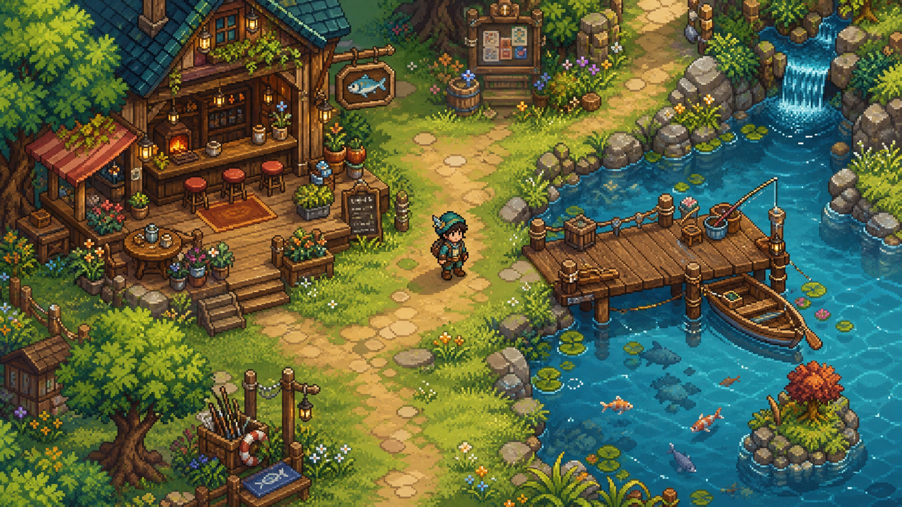

# Pixel-art visual direction

Pond should feel like a modern, high-detail 2D pixel-art RPG while retaining an
original, quieter identity built for a social game.

This concept is a density, palette, and composition reference. It is not a
tileset or a source of production sprites. Runtime assets should be authored at
the game's native pixel scale and remain modular, readable, and inexpensive to
render.

## Visual pillars

- Crisp integer-scaled pixels at a 640×360 internal resolution
- Top-down three-quarter environmental forms
- Strong silhouettes at gameplay scale
- Dense detail concentrated around landmarks and social spaces
- Layered ground, path, shoreline, structure, prop, and foreground depth
- Cohesive greens, teal water, warm timber, and restrained accent colors
- Small ambient movement in water, plants, light, and character idles
- Original characters, maps, tiles, props, and animation language

## Scene composition

The commons should read immediately at a glance. Paths connect the lounge,
pond, neighborhood, and future activity spaces. Public landmarks carry more
detail than transitional ground so players naturally understand where people
will gather.

Depth comes from overlapping layers and shadows rather than a true isometric
camera. Roofs, tree canopies, posts, dock edges, and foreground plants can pass
in front of characters when appropriate. Walkable surfaces remain visually
quiet enough that character silhouettes and nameplates stay readable.

## Character scale

Characters should use compact sprites with readable hair, face direction,
clothing color, and held items. A small two-frame step and one-pixel body bob
are sufficient for the early prototype. Later animation can add turns, sits,
emotes, casting, reeling, and catch reveals without changing the base scale.

## Current technical baseline

- Native viewport: 640×360
- Default window: 1280×720 using integer scaling
- Nearest-neighbor canvas textures
- Pixel-snapped 2D transforms and vertices
- Compatibility renderer
- Server-authoritative positions with client-side visual interpolation

The current settlement master is a 1920×1080 layout prototype spanning nine
camera regions. It establishes district scale and composition, but it is still
one large background image. Once the layout feels right in playtests, it should
be decomposed gradually into an original ground tileset, structures, props,
water animation, and foreground occlusion layers rather than treated as the
final production map format.
